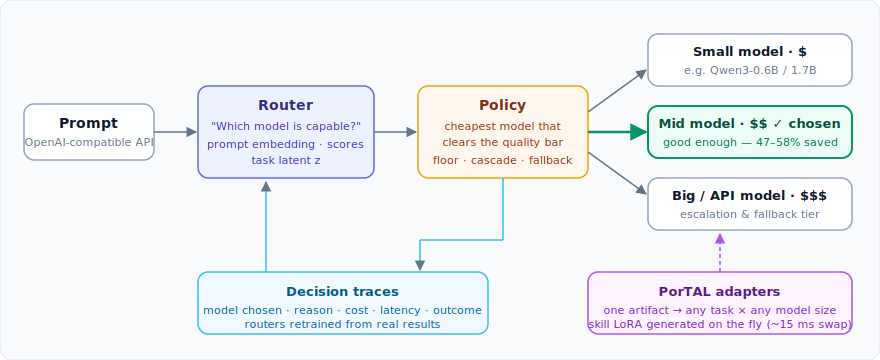

# modelrouter

[](https://github.com/sachinkesiraju/modelrouter/actions/workflows/ci.yml)

*Route each query to the cheapest model that can do the job. Load the task-specific LoRA adapter for that model at request time, generated from a single PorTAL artifact.*

Most requests don't need the largest model. A router trained on per-model correctness can send each request to the cheapest model that will get it right, and apply the task-specific LoRA adapter at runtime.

Inspired by [Ramp Router](https://ramp.com/router) and Ramp's work on [cost-efficient LLM routing](https://builders.ramp.com/post/thompson-sampling-model-routing).



## Headline result

> **Learned routing cut inference cost by 58% while giving up only 2.8 accuracy points versus always running the largest model in the ladder (Qwen3-4B). A prompt-only router, which decides before any model runs, still cut cost by 47% at a 1.1 point drop.**

The same router applied to a commercial frontier ladder (gpt-5.4-nano / gpt-5.4-mini / gpt-5.6, real per-request API costs) cut spend by 40.7% at a 3.6 point drop versus always calling gpt-5.6 (`experiments/exp06_commercial_api/`).

Measured on 14 tasks / 1,230 held-out rows (local ladder: GPU-trained refits on Modal A100/A10G; `experiments/exp04_gpu_scale/`, `exp05_vllm_bench/`):

| Result | Value |
|---|---|
| **Cheapest-capable routing (3-tier ladder)** | **58.4% cost savings at −2.8 pp accuracy** (CI: 56.9–59.6%) |
| Near-zero-loss operating point | 44.7% savings at −0.2 pp |
| **Prompt-only router (usable live, pre-inference)** | **47.0% savings at −1.1 pp** (1.7B vs 4B) |
| Routing headroom (oracle, 3-tier) | +12.3 pp accuracy *above* always-largest at 59.2% savings |
| Task-latent `z` tier prediction for unseen tasks | 100% leave-one-task-out |
| vLLM task-adapter hot-swap overhead | 15.4 ms = 2.2% of a request |
| **Commercial ladder (gpt-5.4-nano/mini → gpt-5.6, real $)** | **40.7% spend cut at −3.6 pp** (CI: 38.4–43.0%) |
| Commercial oracle headroom | +6.0 pp accuracy *above* always-gpt-5.6 at 86% savings |

CPU-scale results (reproducible on an 8 GB laptop) are in `experiments/exp01–03/*/report.md`; every number in this README traces to a JSON result file and report committed under `experiments/`.

## Components

- **Routers** (`routing`): score-distribution, prompt-embedding (live path), and task-latent `z` routers, plus a task classifier.
- **Policies** (`dispatch`): floor (cheapest model within a quality floor) and cascade (run cheap, escalate on low confidence).
- **Runtime** (`runtime`): HF backend that hot-swaps PorTAL task LoRAs with an adapter cache.
- **Gateway** (`serve`): production OpenAI-compatible gateway: per-route YAML policies, LiteLLM commercial tier with real $/token costs, shadow mode, fallback chains, API keys, abstain-to-capable, JSONL decision traces, and router retraining from traces (`learning`). Validated live against Together AI.
- **Eval** (`eval`): policy stats, bootstrap CIs, Pareto plots, and a machine-checkable quality/cost acceptance gate.

## Quickstart

```bash
pip install torch --index-url https://download.pytorch.org/whl/cpu   # or your CUDA build
pip install -e ".[serve,plots,dev]"

# serve the gateway
modelrouter serve --config configs/routes.example.yaml

# reproduce the headline table from the committed GPU score bundles (no GPU needed)
python experiments/exp04_gpu_scale/run_sweep.py
```

Full reproduction (CPU experiments from scratch, Modal GPU runs) is documented in each `experiments/*/report.md`. See `docs/architecture.md` and `docs/roadmap.md` for design and the productization plan.

## Limitations

A validated research artifact plus a working single-node router, not a production service:

- **Benchmark scope**: 14 multiple-choice tasks with programmatic graders; free-form generation quality is not measured.
- **Model scope**: local GPU ladder tops out at Qwen3-4B; commercial routing validated on one provider (OpenAI, gpt-5.4-nano/mini/gpt-5.6) plus a live Together AI gateway test.
- **Cost model**: local-tier savings use parameter-proportional costs; GPU amortization not modeled.
- **Serving**: single-request benchmarks only; vLLM's LoRA path adds a steady ~23% latency vs the bare base (shrinks with batching). No streaming, batching, or load testing.
- **Operations**: no multi-tenant control plane, quotas, health checks, or K8s packaging (see `docs/roadmap.md`).
- **Task-agnostic mode**: lightly validated; guarded by abstain-to-capable.

## License

Apache-2.0.
